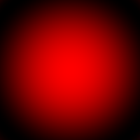

Tutorial
========

Create an image and export it
-----------------------------

Create a temporary xcf file containing a sphere and export it to png.

Source code:

.. literalinclude:: ../../pgimp/doc/examples/generate_sphere.py
   :language: python
   :linenos:

Result:

Create a multi layer image and export to npz
--------------------------------------------

Create a multi layer image with a mask and export the layers to a numpy npz archive.
Read the npz file, apply the mask, create a new gimp file and export it to png.

Source code:

.. literalinclude:: ../../pgimp/doc/examples/multilayer_to_npz.py
   :language: python
   :linenos:

Result:

